# OverTheWire Bandit Notes

> These notes document my OverTheWire Bandit practice through Level 20. Screenshots are kept as part of the original challenge record.

Linux command-line practice completed as part of my Linux Fundamentals training.

I worked through Bandit Levels 0 to 20 to practise SSH, file navigation, permissions, searching, text processing, pipes, redirection, networking, compression and troubleshooting.

---

## Bandit Level 0

### Goal

Log into the Bandit server using SSH.

### Command Used

```bash
ssh -p 2220 bandit0@bandit.labs.overthewire.org
```

### Screenshots

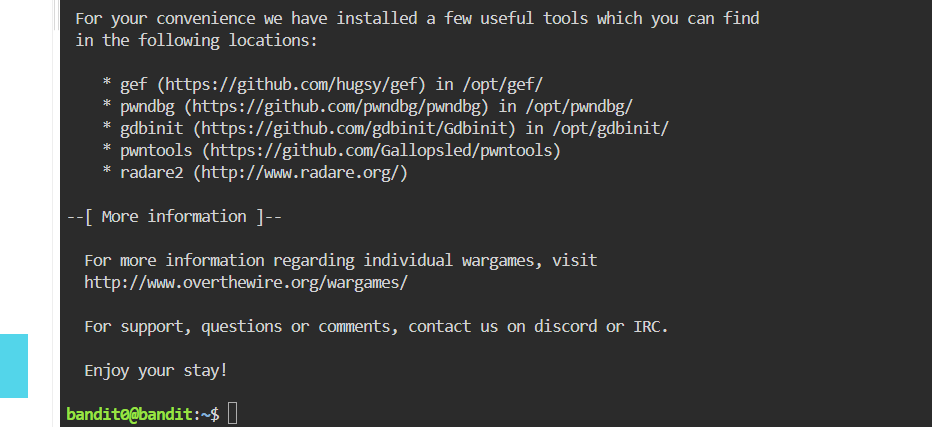

### What I Learned

I learnt the basic SSH format `username@host` and how to connect using a specific port with `-p`.

---

## Bandit Level 0 → Level 1

### Challenge

Log into the Bandit server, find the file in the home directory and read the password for the next level.

### Commands Used

```bash
ls
cat readme
```

### Screenshots

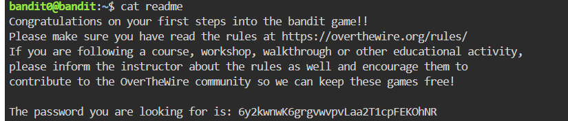

### Explanation

- `ls` showed the files in the current directory.
- `cat readme` displayed the contents of the `readme` file.

### Challenge I Had

I made a few mistakes with the SSH command at first, including typing `sh` instead of `ssh` and getting the username format wrong. Reading the error messages helped me fix it.

### What I Learned

I practised connecting to a remote Linux machine with SSH, listing files and reading a text file from the terminal.

---

## Bandit Level 1 → Level 2

### Challenge

The password was stored in a file called `-`.

### Commands Used

```bash
ls
cat ./-
```

### Screenshots

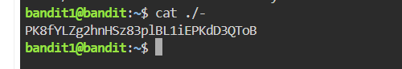

### Explanation

`./` means the current directory. Using `./-` makes it clear that `-` is the filename rather than part of a command option.

### What I Learned

I learned that unusual filenames may need an explicit path such as `./` in front of them.

---

## Bandit Level 2 → Level 3

### Challenge

The password was stored in a file with spaces in its name.

### Commands Used

```bash
ls
cat ./"--spaces in this filename--"
```

### Screenshots

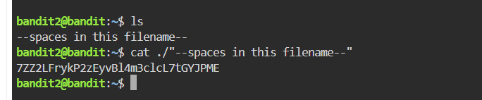

### Explanation

Quotation marks keep the spaces together as one filename. `./` also helps when a filename begins with characters such as `--` that could otherwise look like command options.

### Challenge I Had

I first copied the filename from an older instructor video, but my live Bandit level used a slightly different name. I learned to trust the exact filename shown by `ls`.

### What I Learned

Linux filenames need to be typed exactly as they appear. Quoting is useful when filenames contain spaces.

---

## Bandit Level 3 → Level 4

### Challenge

The password was hidden inside the `inhere` directory.

### Commands Used

```bash
ls
cd inhere
ls -a
cat ...Hiding-From-You
```

### Screenshots

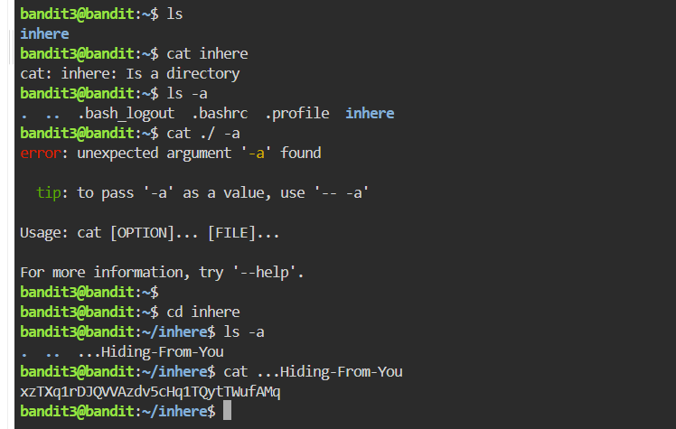

### Explanation

A normal `ls` did not show the hidden file, so I used `ls -a`. Files beginning with `.` are hidden by default.

### Challenge I Had

I first tried to `cat` the `inhere` directory and got an `Is a directory` error. I then moved into it with `cd` and checked for hidden files.

### What I Learned

I reinforced the difference between files and directories and learned to use `ls -a` when I suspect a hidden file is present.

---

## Bandit Level 4 → Level 5

### Challenge

Find the only human-readable file inside the `inhere` directory.

### Commands Used

```bash
ls
cd inhere
file ./*
cat ./-file07
```

### Screenshots

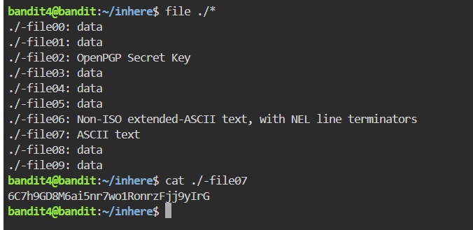

### Explanation

`file ./*` checked the type of every file in the current directory. Most were reported as data, while `-file07` was shown as ASCII text.

### Challenge I Had

I initially tried opening the files one by one with `cat`, but most of the output was unreadable. I went back to the wording of the challenge and used `file` instead.

### What I Learned

I learned that `file` can identify the type of data stored in a file and that `./` is useful for filenames beginning with `-`.

---

## Bandit Level 5 → Level 6

### Challenge

Find a file inside `inhere` that was human-readable, 1033 bytes in size and not executable.

### Commands Used

```bash
ls
cd inhere
find ./ -size 1033c
cd maybehere07
ls -a
cat ./.file2
```

### Screenshots


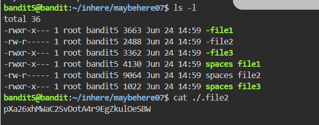

### Explanation

`find ./ -size 1033c` searched recursively from the current directory for something exactly 1033 bytes in size. The result pointed to a hidden file called `.file2`.

### Challenge I Had

I first missed the space between `./` and `-size`, which caused Linux to treat `./-size` as a path. I also had to pay attention to the leading dot in `.file2`.

### What I Learned

I learned how to use `find` instead of manually checking lots of directories and reinforced how hidden filenames work.

---

## Bandit Level 6 → Level 7

### Challenge

Find a file somewhere on the server that was:

- owned by user `bandit7`
- owned by group `bandit6`
- exactly 33 bytes

### Commands Used

```bash
find / -type f -user bandit7 -group bandit6 -size 33c
find / -type f -user bandit7 -group bandit6 -size 33c 2>/dev/null
cat /var/lib/dpkg/info/bandit7.password
```

### Screenshots

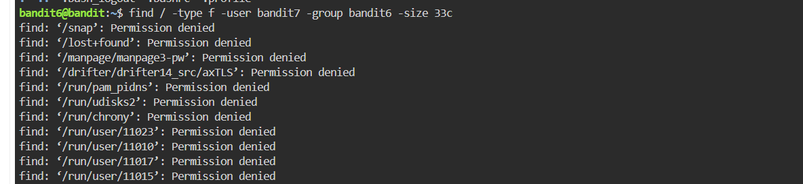

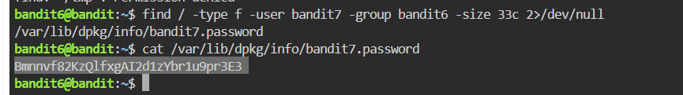

### Explanation

I searched from `/` because the file could be anywhere on the server.

- `-type f` searched for regular files only.
- `-user bandit7` filtered by owner.
- `-group bandit6` filtered by group.
- `-size 33c` filtered by exact byte size.
- `2>/dev/null` redirected error output so the useful result was easier to see.

### Challenge I Had

My first full-system search returned lots of `Permission denied` messages. I learned that the search itself could still be working and that stderr could be redirected separately.

### What I Learned

This level helped me understand how several `find` conditions can be combined and introduced me to stderr redirection with `2>/dev/null`.

---

## Bandit Level 7 → Level 8

### Challenge

Find the line in `data.txt` containing the word `millionth`.

### Commands Used

```bash
cat data.txt
grep millionth data.txt
```

### Screenshots


### Explanation

`cat data.txt` produced too much output. `grep millionth data.txt` searched directly for the line I needed.

### Challenge I Had

My first attempt flooded the terminal with text. I stopped it with `Ctrl+C` and switched to a more targeted search.

### What I Learned

I learned when `grep` is more useful than `cat` for large files and reinforced that `Ctrl+C` stops a running command.

---

## Bandit Level 8 → Level 9

### Challenge

Find the only line in `data.txt` that occurs once.

### Commands Used

```bash
sort | uniq -u data.txt
sort data.txt | uniq -u
```

### Screenshots


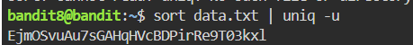

### Explanation

The file needed to be sorted first so repeated lines were grouped together. The output of `sort` was then piped into `uniq -u`, which showed only the line that occurred once.

### Challenge I Had

I understood that I needed `sort` and `uniq`, but I originally put `data.txt` on the wrong side of the pipe.

### What I Learned

I learned that pipeline order matters and reinforced the difference between `|` and `>`.

---

## Bandit Level 9 → Level 10

### Challenge

Find a human-readable string inside mostly unreadable data. The target line was preceded by several `=` characters.

### Command Used

```bash
strings data.txt | sort | grep "="
```

### Screenshots


### Explanation

`strings` extracted readable text and `grep "="` filtered for lines containing `=`. I also used `sort`, although I later realised it was not needed for this challenge.

### What I Learned

I learned how `strings` can pull readable text out of binary data and how commands can be chained together with pipes.

---

## Bandit Level 10 → Level 11

### Challenge

Decode the Base64 contents of `data.txt`.

### Commands Used

```bash
cat data.txt
cat data.txt | base64
base64 --help
cat data.txt | -d base64
cat data.txt | base64 -d
```

### Screenshots


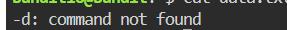


### Explanation

Running `base64` without `-d` encoded the data again. I used `base64 --help`, found the decode option and then corrected the command structure to `base64 -d`.

### Challenge I Had

I first placed `-d` before the command, which made the shell treat it like a command of its own.

### What I Learned

I learned the difference between Base64 encoding and decoding and reinforced the common structure `command option`.

---

## Bandit Level 11 → Level 12

### Challenge

Decode ROT13 text stored in `data.txt`.

### Commands Used

```bash
cat data.txt < tr 'A-Za-z' 'N-ZA-Mn-za-m'
cat data.txt | tr 'A-Za-z' 'N-ZA-Mn-za-m'
```

### Screenshots


### Explanation

`tr` translates characters from one set to another. For ROT13, the alphabet is shifted by 13 positions.

```text
A-M ↔ N-Z
a-m ↔ n-z
```

The working command sent the output of `cat` into `tr` using a pipe.

### Challenge I Had

I initially struggled to understand how `tr` matched SET1 and SET2. I also mixed up `<` with `|`, which caused Bash to treat `tr` as a filename.

### What I Learned

I learned how ROT13 works, how `tr` maps characters by position and the difference between a pipe and input redirection.

---

## Bandit Level 12 → Level 13

### Challenge

Reverse a hexdump and work through several layers of compression until the final plain-text file is reached.

### Commands Used

```bash
mktemp -d
cp data.txt /tmp/<temporary-directory>
cd /tmp/<temporary-directory>
mv data.txt MB
xxd -r MB > password1
file password1
cat password1 | gzip -d > password2
file password2
cat password2 | bzip2 -d > password3
file password3
cat password3 | gzip -d > password4
file password4
```

I continued checking each new file with `file` and used the matching gzip, bzip2 or tar tool until I reached ASCII text.

### Screenshots

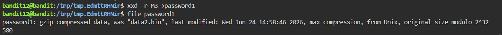

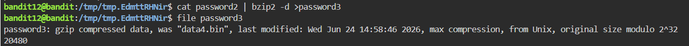

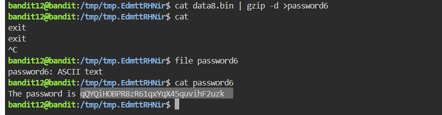

### Explanation

The main workflow became:

```text
file
↓
identify the format
↓
use the matching decompression/extraction tool
↓
inspect the next file
↓
repeat
```

### Challenge I Had

This was one of the hardest levels for me. I printed binary data directly to the terminal, hit gzip filename-suffix issues, tried redirecting tar output in the wrong way and once wrote command output back into the same file I was reading from.

That last mistake taught me an important lesson: `>` truncates the destination before the command reads from it, so using the same file as input and output can destroy the data.

### What I Learned

I learned to inspect file types instead of guessing from extensions and to treat gzip, bzip2 and tar differently depending on what `file` reports.

---

## Bandit Level 13 → Level 14

### Challenge

Use the provided private SSH key to log in as `bandit14`.

### Commands Used

```bash
ls
cat HINT
cat sshkey.private
scp -P 2220 bandit13@bandit.labs.overthewire.org:~/sshkey.private .
ls -l
chmod o=-rwx sshkey.private
chmod g=-rwx sshkey.private
ssh -i sshkey.private -p 2220 bandit14@bandit.labs.overthewire.org
```

### Screenshots

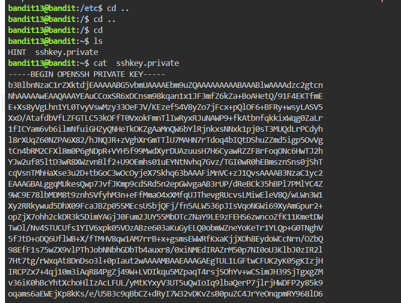

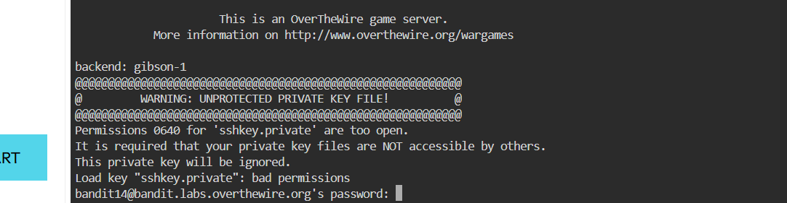

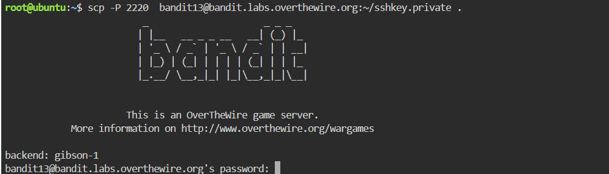


### Explanation

The password file could not be read directly as `bandit13`, so I used the provided SSH private key instead. Because direct hopping between Bandit levels was blocked in my setup, I copied the key to Killercoda using `scp` and then used `ssh -i`.

SSH rejected the key at first because its permissions were too open, so I removed permissions for group and other users.

### Challenge I Had

I had to understand the difference between password authentication and SSH key authentication, then work out the source/destination structure used by `scp`.

### What I Learned

I learned how `scp` copies files over SSH, how `ssh -i` selects a private key and why private-key permissions need to be restrictive.

> The original screenshot showing the full private key has been deliberately excluded from this public version.

---

## Bandit Level 14 → Level 15

### Challenge

Submit the current Bandit password to a service on `localhost` port `30000`.

### Commands Used

```bash
man nc
nc -C localhost 30000
```

### Screenshots

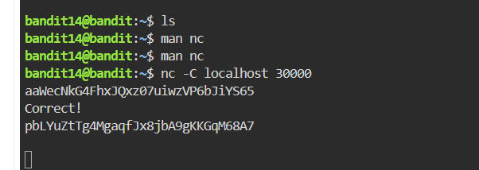

### Explanation

I learned that `localhost` referred to the Bandit server I was already connected to. Netcat opened a connection to the service and then waited for input.

### Challenge I Had

I initially mixed up SSH-style syntax and Netcat options. I also tried listen mode with `-l`, which was the wrong direction because the service was already listening.

### What I Learned

I learned the difference between listening for a connection and connecting to an existing service. I also learned that a blank terminal after connecting can simply mean the service is waiting for input.

---

## Bandit Level 15 → Level 16

### Challenge

Submit the current password to `localhost:30001` using SSL/TLS.

### Commands Used

```bash
man openssl
man openssl-s_client
openssl s_client -connect localhost:30001
```

### Screenshots


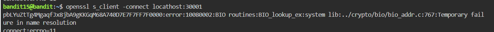

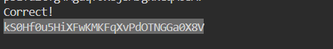

### Explanation

This level was similar to the previous one, except the service required an encrypted SSL/TLS connection. I used the `s_client` part of OpenSSL and specified the destination with `-connect host:port`.

### Challenge I Had

I first used the wrong OpenSSL command structure and later made a hostname typo. The name-resolution error helped me notice the spelling mistake.

### What I Learned

I learned the basic structure of `openssl s_client -connect host:port` and the difference between a plain Netcat connection and an SSL/TLS connection.

---

## Bandit Level 16 → Level 17

### Challenge

Find the correct service between ports `31000` and `32000`, submit the current password over SSL/TLS and use the returned SSH private key to log in as `bandit17`.

### Commands Used

```bash
nmap -p 31000-32000 localhost
openssl s_client -connect localhost:PORT
openssl s_client -nocommands -connect localhost:31790
chmod 700 bandit17key
ssh -i bandit17key -p 2220 bandit17@bandit.labs.overthewire.org
```

### Screenshots

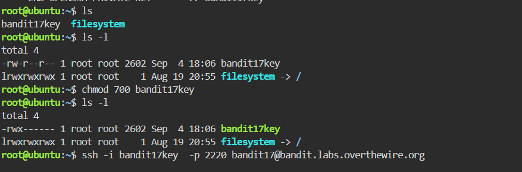


### Explanation

`nmap` reduced the port range to a small set of open ports. I then tested SSL/TLS services with `openssl s_client`.

An unusual issue appeared because the first character of my password was being interpreted by OpenSSL as a connected command. Reading the OpenSSL manual led me to `-nocommands`, which disabled those interactive commands.

The correct service returned a private SSH key, which I saved as a file and supplied to SSH using `-i`.

### Challenge I Had

The hardest part was understanding that private-key text printed in the terminal is not automatically a usable key file. I had to save it as a real file and protect its permissions before SSH could use it.

### What I Learned

I learned how to scan a port range, test SSL/TLS services, use `-nocommands` and authenticate with a private key instead of a password.

---

## Bandit Level 17 → Level 18

### Challenge

Compare `passwords.old` and `passwords.new` and find the one changed line.

### Commands Used

```bash
ls
diff passwords.old passwords.new
```

### Screenshots

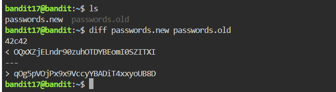

### Explanation

`diff` compares files and shows the lines that differ.

One thing I noticed while cleaning these notes is that my written notes show `diff passwords.old passwords.new`, while my original screenshot shows the files in the reverse order. That means I need to read the `<` and `>` markers based on the exact order I used in the command rather than memorising one symbol as always meaning “old” or “new”.

### What I Learned

I learned how to compare two versions of a file quickly instead of searching through both manually.

---

## Bandit Level 18 → Level 19

### Challenge

Read the `readme` file even though `.bashrc` immediately logs me out when I try a normal interactive SSH session.

### Commands Used

```bash
ssh -p 2220 bandit18@bandit.labs.overthewire.org ls
ssh -p 2220 bandit18@bandit.labs.overthewire.org cat readme
```

### Screenshots

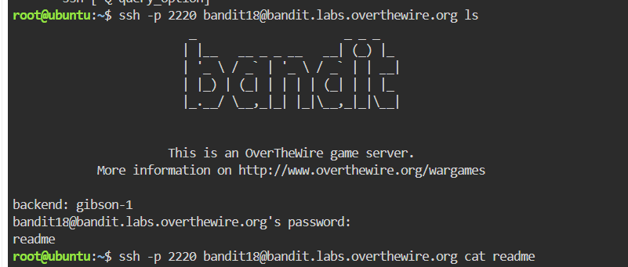

### Explanation

I learned that SSH does not have to open an interactive shell. A command can be added after `user@host`, allowing SSH to connect, run that command remotely and return the output.

### Challenge I Had

At first I thought I needed another SSH option. The important clue was that the SSH connection worked but the interactive shell startup was the problem.

### What I Learned

The useful pattern from this level was:

```text
ssh [options] user@server command
```

This can be useful when an interactive shell is broken or behaves unexpectedly.

---

## Bandit Level 19 → Level 20

### Challenge

Use the setuid executable `bandit20-do` to run a command with Bandit 20's privileges and read the password file.

### Commands Used

```bash
ls
echo $PATH
./bandit20-do
./bandit20-do whoami
./bandit20-do cat /etc/bandit_pass/bandit20
```

### Screenshots


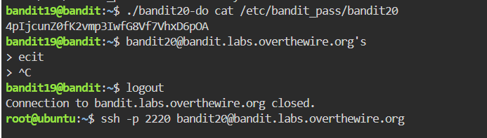

### Explanation

Running:

```bash
./bandit20-do whoami
```

returned `bandit20`, proving that commands passed through the wrapper were running with Bandit 20's privileges.

The command structure became:

```text
wrapper program → command → target
```

### Challenge I Had

I tried `sudo`, read the binary with `cat`, ran `cat` without a target file and accidentally gave `cat` the `/etc/bandit_pass` directory instead of the file inside it.

Each error helped me understand whether I was dealing with a program, a command, a file or a directory.

### What I Learned

I learned the basic setuid concept, why `./` is needed for executables in the current directory when it is not in `$PATH`, and how command argument order affects what Linux actually does.

---

## Main Skills Practised

- Linux filesystem navigation
- Hidden and unusual filenames
- `find`, `grep`, `sort`, `uniq`, `strings`, `tr` and `diff`
- Pipes and redirection
- stdin, stdout and stderr
- Permissions and private SSH keys
- SSH and SCP
- Netcat and localhost services
- OpenSSL and SSL/TLS
- Nmap and port scanning
- Base64 and ROT13
- Hexdumps and compression formats
- setuid executables
- Reading Linux error messages and debugging one step at a time

## Biggest Lesson

The main thing I improved while working through Bandit was troubleshooting. Instead of changing several things at once, I became better at reading the exact error, checking the command structure and trying the next small correction.
