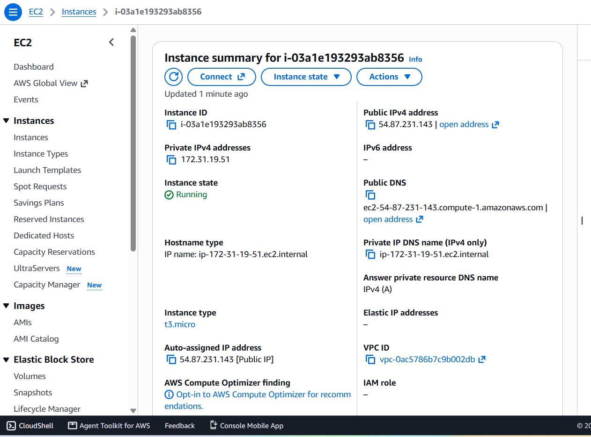
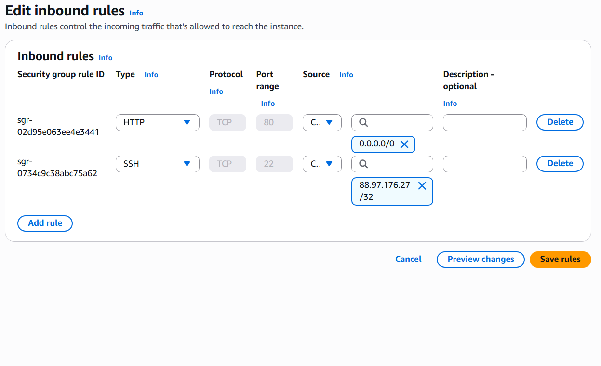
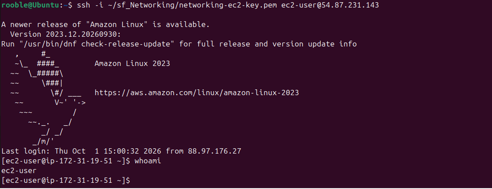
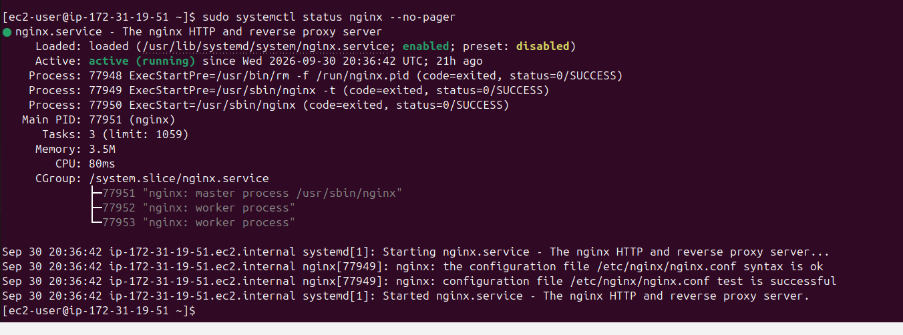
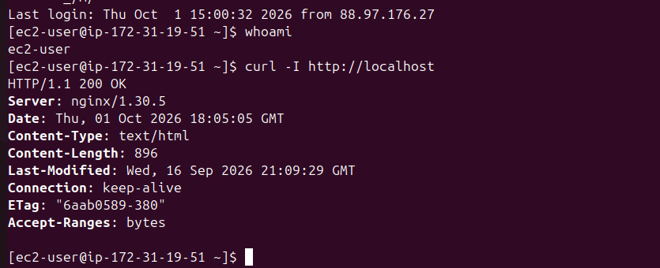
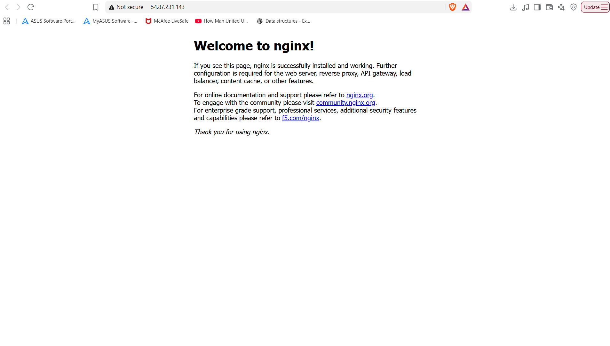
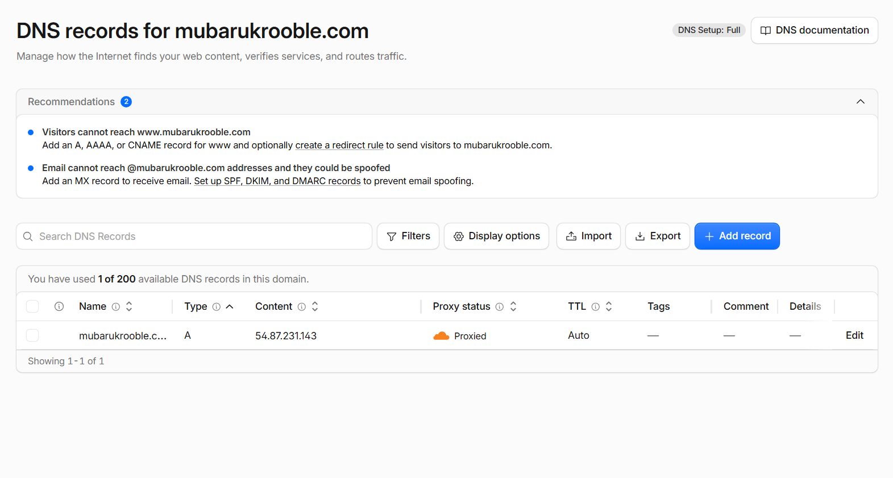
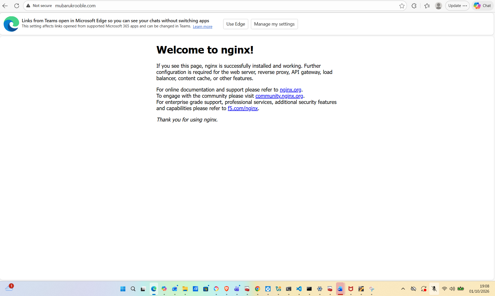
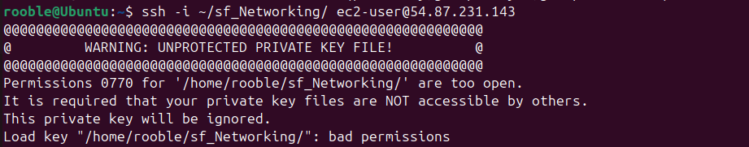

# EC2, NGINX and DNS Networking Project

## Project overview

For this project, I launched an Amazon EC2 instance, installed NGINX, configured network access with an AWS security group, and connected a custom domain using Cloudflare DNS.

The purpose was to understand how a browser request travels from a domain name to a web server.

## What I built

| Component | Details |
|---|---|
| Cloud provider | AWS |
| Server | Amazon EC2 |
| Operating system | Amazon Linux 2023 |
| Instance type | `t3.micro` |
| Web server | NGINX |
| DNS provider | Cloudflare |
| Domain | `mubarukrooble.com` |
| Protocol tested | HTTP |

At the time of testing, the EC2 public IP address was `54.87.231.143`.

## How the request works

```text
Browser → Cloudflare DNS → EC2 public IP → Security group port 80 → NGINX
```

## 1. Launching the EC2 instance

I created an EC2 instance using Amazon Linux 2023 in the AWS `us-east-1` region.

<details>
<summary>View EC2 instance screenshot</summary>

<p></p>

</details>

## 2. Configuring the security group

I configured the inbound rules as follows:

| Type | Port | Source | Purpose |
|---|---:|---|---|
| SSH | 22 | My IP address `/32` | Secure administration |
| HTTP | 80 | `0.0.0.0/0` | Allow public web traffic |

SSH was restricted to my own IP address, while HTTP was open so that the website could be accessed publicly.

<details>
<summary>View security group screenshot</summary>

<p></p>

</details>

## 3. Connecting to the server

I connected to the EC2 instance from my Ubuntu VirtualBox machine using SSH:

```bash
ssh -i ~/sf_Networking/networking-ec2-key.pem ec2-user@54.87.231.143
```

The private key stayed outside the Git repository and was not committed.

<details>
<summary>View SSH connection screenshot</summary>

<p></p>

</details>

## 4. Installing NGINX

After connecting to the server, I installed and started NGINX:

```bash
sudo yum install -y nginx
sudo systemctl enable nginx
sudo systemctl start nginx
sudo systemctl status nginx --no-pager
```

The service status confirmed that NGINX was running successfully.

<details>
<summary>View NGINX status screenshot</summary>

<p></p>

</details>

## 5. Testing the server locally

I tested NGINX from inside the EC2 instance:

```bash
curl http://localhost
curl -I http://localhost
```

The response displayed the default NGINX welcome page and returned an HTTP `200 OK` status.

<details>
<summary>View local test screenshot</summary>

<p></p>

</details>

## 6. Testing the public IP address

I tested the server from a browser using its public IP address.

<details>
<summary>View public IP test screenshot</summary>

<p></p>

</details>

## 7. Configuring Cloudflare DNS

I created an A record in Cloudflare to connect the domain to the EC2 public IP:

| Record type | Name | Value |
|---|---|---|
| A | `@` | `54.87.231.143` |

<details>
<summary>View Cloudflare DNS screenshot</summary>

<p></p>

</details>

## 8. Testing the domain

After DNS updated, I visited:

```text
http://mubarukrooble.com
```

The NGINX welcome page loaded successfully through the domain.

<details>
<summary>View domain test screenshot</summary>

<p></p>

</details>

## Challenges and troubleshooting

One issue happened when I accidentally passed the shared folder to SSH instead of the private-key file. SSH requires the path to the actual `.pem` file.

The correct command was:

```bash
ssh -i ~/sf_Networking/networking-ec2-key.pem ec2-user@54.87.231.143
```

The public IP also timed out during an early test. I checked the security-group rules, confirmed that port 80 was open, verified that NGINX was running, and tested the service locally before trying again.

<details>
<summary>View SSH troubleshooting screenshot</summary>

<p></p>

</details>

## What I learned

This project helped me understand:

- The difference between private and public IP addresses
- How AWS security groups control inbound traffic
- Why SSH uses port 22 and HTTP uses port 80
- How to install and manage Linux services with `systemctl`
- How DNS A records connect domains to IPv4 addresses
- How a browser request reaches an NGINX web server
- Why private SSH keys must never be uploaded to GitHub

## Security considerations

- SSH access was restricted to my own IP address.
- HTTP traffic was allowed publicly through port 80.
- The `.pem` private key was not committed.
- No passwords, access keys, or other secrets were included in the repository.

## Future improvements

The next improvements I would make are:

- Configure HTTPS with an SSL certificate
- Use an Elastic IP so the address does not change
- Replace the default NGINX page with a custom webpage
- Add monitoring and logging
- Rebuild the infrastructure using Terraform

This project gave me practical experience with AWS, Linux, NGINX, security groups, DNS, and network troubleshooting.